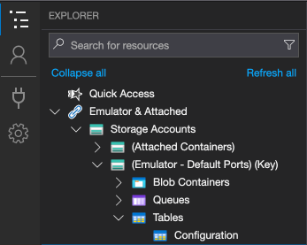
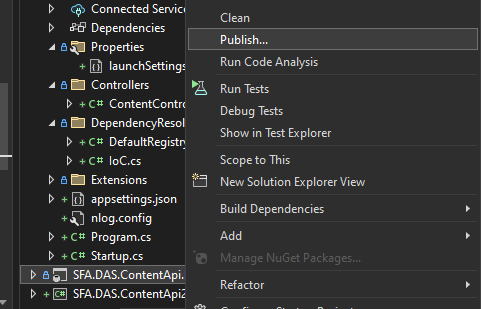
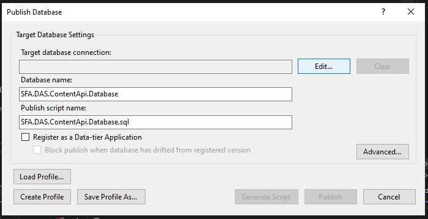
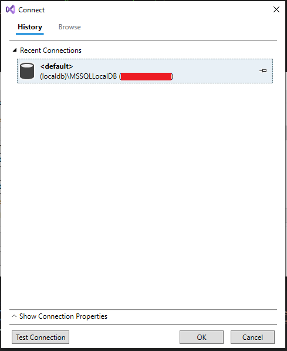

# Content API

.NET 6 API. 

## Setting up

Ensure either [Azure Storage Emulator](https://learn.microsoft.com/en-us/azure/storage/common/storage-use-emulator) or [Azurite](https://learn.microsoft.com/en-us/azure/storage/common/storage-use-azurite) is installed and running, the application will retrieve the config strings from there. 

_For macos/Linux use Azurite with Docker Hub_

### Connection Strings 

Using [Azure Storage Explorer](https://azure.microsoft.com/en-gb/products/storage/storage-explorer), ensure under `Storage Accounts` - `Emulator` - `Tables` that there is a table named `Configuration`, open it. 



Ensure that there is an entry with the PartitionKey `LOCAL` and the RowKey `SFA.DAS.ContentApi_1.0`, make sure that there is a property named `Data` of type string, set to the following format:

```json
{
    "DatabaseConnectionString": "[SQL Server Connection String]",
    "ActiveDirectorySettings": {
        "Tenant": "",
        "IdentifierUri": "",
        "AppId": ""
    }
}
```

_The Active Directory settings can just be left as blank strings for local debugging purposes._

Ensure that there is a valid connection string to an accessible SQL Server DB, for local databases this is usually:

`Data Source=[Database Server Name];Database=SFA.DAS.ContentApi.Database;Integrated Security = true;Trusted_Connection=True;Pooling=False;Connect Timeout=30;MultipleActiveResultSets=True;ConnectRetryCount=3;ConnectRetryInterval=2`

### Deploy Local Database 

Using Visual Studio, right click on the `SFA.DAS.ContentAPI.Database` project and click `Publish`. 



Click `Edit` the target databases name in the publishing popup. 



Select your local database. 



Click OK, ensure that the Database Name is set to `SFA.DAS.ContentApi.Database` and then click `Publish`. 

Then set the database server name in the above connection string in the storage emulator to the name of the database you have selected, in the above case this `(localdb)\\MSSQLLocalDB`, so the DB connection string would be:

`Data Source=(localdb)\\MSSQLLocalDB;Database=SFA.DAS.ContentApi.Database;Integrated Security = true;Trusted_Connection=True;Pooling=False;Connect Timeout=30;MultipleActiveResultSets=True;ConnectRetryCount=3;ConnectRetryInterval=2`

### Running 

Set the startup project as `SFA.DAS.ContentApi.Api` and run under Kestrel.
This should open up a browser to `https://localhost:5001` and show a Swagger API page where the endpoints can be tested. 
